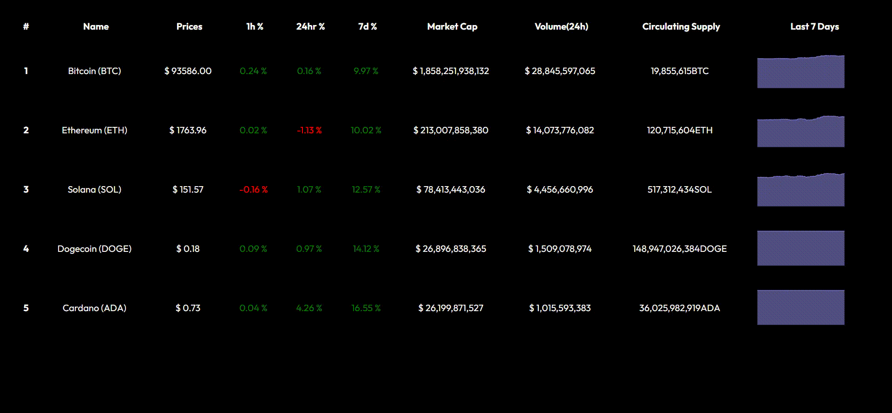

# 🪙 Crypto Tracker App

A real-time cryptocurrency tracker built with **React.js**, **Redux**, and **Recharts**, featuring:

- 📊 1h / 24h / 7d price change tracking  
- 💰 Market cap, volume, and circulating supply  
- 📈 7-day mini line chart using Recharts  
- 🔁 Auto-refresh every 14 seconds  
- 🌐 Fully dynamic data from CoinGecko API

---

## 🚀 Features

- ⏱️ Auto-fetch data every 14 seconds  
- 📥 CoinGecko API used for:
  - Current price
  - Price change percentages (1h, 24h, 7d)
  - Market cap, 24h volume, circulating supply
  - Sparkline (7-day historical prices)
- 📦 Redux for global state management  
- 📈 Sparkline charts rendered with **Recharts**

---

## 📦 Tech Stack

- **Frontend:** React.js  
- **State Management:** Redux + Redux Toolkit  
- **Charts:** Recharts  
- **API:** CoinGecko REST API

---

## 🧰 Installation

```bash
git clone https://github.com/your-username/crypto-tracker.git
cd crypto-tracker
npm install
npm start
```

---

## 🧪 Usage

1. Add crypto coins to the `currencies` array (e.g., `['bitcoin', 'ethereum', 'solana']`)
2. App fetches details for each coin using:
   - `/coins/{id}` for market data
   - `/coins/{id}/market_chart` for 7-day price history
3. Redux stores and updates the global state every 14 seconds
4. Charts update automatically using Recharts

---

## 🧠 Developer Notes

- All CoinGecko calls are made from the **frontend**, so no backend needed  
- Includes CORS handling (works without proxy)  
- Uses `Promise.all()` to fetch both main data and chart data for each coin  
- Cleaned and normalized data is dispatched to Redux via `fillData()`  
- React `useRef` and `useEffect` used for optional performance tweaks  

---

## 🖼️ Preview



---

## 📁 Folder Structure

```
cryptocurrency/
├── .github/
├── dist/
├── node_modules/
├── public/
│   └── recording.gif       # Your preview/demo gif
├── src/
│   ├── assets/             # (Optional) Store icons/images if needed
│   ├── components/
│   │   └── CoinTracker.jsx
│   ├── redux/
│   │   ├── dataSlice.jsx   # Redux slice for crypto data
│   │   └── store.jsx       # Redux store setup
│   ├── App.jsx
│   ├── App.css
│   ├── index.jsx
│   ├── index.css
│   └── main.jsx
├── .gitignore
├── README.md
├── package.json
├── package-lock.json
├── vite.config.js
└── eslint.config.js
```

---
